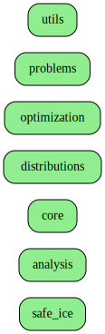
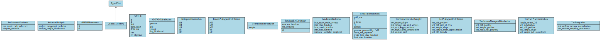
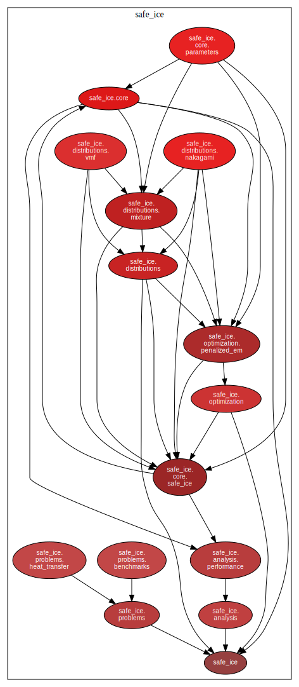

# Architecture Documentation

*Auto-generated on 2025-12-07*

## Project Overview

- **Python Files:** 21
- **Test Files:** 1
- **Frameworks:** None detected

## Architecture Diagrams

### High-Level Architecture

### Module Dependencies

### Class Structure

### Package Dependencies

## Key Components

Main directories:
- `benchmarks/`
- `docs/`
- `architecture/`
- `safe_ice/`
- `analysis/`
- `core/`
- `distributions/`
- `optimization/`
- `problems/`
- `utils/`
